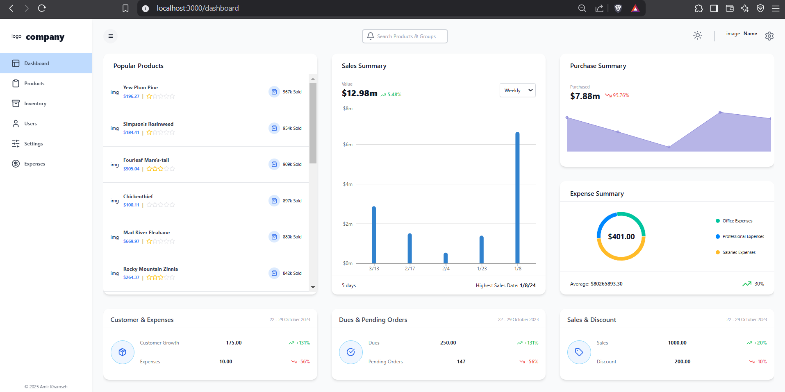

# Inventory Dashboard Project

This project is a practice Next.js application designed to demonstrate a full-stack dashboard experience. It features an inventory management system with comprehensive statistics, built using a modern tech stack.

## Technologies Used

- **Frontend:**
  - Next.js
  - React
  - Redux Toolkit (RTK Query)
  - Material UI (MUI)
  - Recharts
  - Tailwind CSS

## Project Structure

